# RonaldDump – Component diagram

```mermaid
flowchart TB
    subgraph Scenes["🎬 Scenes"]
        Boot["Boot Scene<br/><i>scenes/boot.tscn</i><br/>Registers microgames"]
        MainMenu["Main Menu<br/><i>scenes/MainMenu.tscn</i><br/>Mode selection"]
        GameRoot["Game Root<br/><i>scenes/GameRoot.tscn</i><br/>Gameplay container"]
        YouWon["You Won<br/><i>scenes/YouWon.tscn</i><br/>Victory screen"]
    end
    
    subgraph Autoloads["⚙️ Autoload Singletons"]
        RunMgr["RunManager<br/>Run lifecycle owner"]
        SeqMgr["SequenceManager<br/>Weighted selection + cooldown"]
        Registry["MicrogameRegistry<br/>Holds MicrogameDef entries"]
        TimingCtrl["GlobalTimingController<br/>Phase timing (Instruction→Active→Resolve)"]
        InputRtr["InputRouter<br/>Input normalization + policy"]
        ChaosMgr["ChaosManager<br/>Chaos growth + FX config"]
    end
    
    subgraph Framework["🏗️ Framework"]
        MicrogameBase["MicrogameBase<br/><i>framework/contracts/</i><br/>Microgame contract"]
        ShakeDrv["ShakeDriver<br/><i>framework/chaos/</i><br/>Screen shake FX"]
    end
    
    subgraph Microgames["🎮 Microgames (5 total)"]
        MG01["mg01: Ignore the Expert"]
        MG02["mg02: End the Pandemic"]
        MG03["mg03: Wall Builder"]
        MG04["mg04: Disinfectant Brainstorm"]
        MG05["mg05: Peace Deal Speedrun"]
    end
    
    subgraph Testing["🧪 Testing"]
        GUT["GUT Test Runner<br/><i>addons/gut/</i>"]
        UnitTests["Unit Tests<br/><i>tests/unit/</i>"]
    end
    
    Boot -->|"register_microgame(...)"| Registry
    Boot -->|"initialize(registry)"| SeqMgr
    Boot -->|"change_scene"| MainMenu
    
    MainMenu -->|"sets pending_mode"| RunMgr
    MainMenu -->|"change_scene"| GameRoot
    
    GameRoot -->|"start_run(mode, container)"| RunMgr
    GameRoot -->|"subscribes tier_changed"| ChaosMgr
    GameRoot -->|"reads offset"| ShakeDrv
    
    RunMgr -->|"reset(); apply_result()"| ChaosMgr
    RunMgr -->|"select_next_microgame()"| SeqMgr
    RunMgr -->|"get_enabled_entries()"| Registry
    RunMgr -->|"start_phase(); await complete"| TimingCtrl
    RunMgr -->|"set_policy(); input_delivered"| InputRtr
    RunMgr -->|"instantiate(); activate()"| Microgames
    RunMgr -->|"run_completed → change_scene"| YouWon
    
    SeqMgr -->|"reads entries"| Registry
    
    ChaosMgr -->|"tier_changed(fx_config)"| ShakeDrv
    
    Microgames -.->|"implements"| MicrogameBase
    Microgames -->|"consume_first_input()"| InputRtr
    
    GUT -->|"executes"| UnitTests
    UnitTests -->|"set_defs_for_tests()"| Registry
    
    classDef sceneStyle fill:#e1f5ff,stroke:#0288d1,stroke-width:2px
    classDef autoloadStyle fill:#fff3e0,stroke:#f57c00,stroke-width:2px
    classDef frameworkStyle fill:#f3e5f5,stroke:#7b1fa2,stroke-width:2px
    classDef microgameStyle fill:#e8f5e9,stroke:#388e3c,stroke-width:2px
    classDef testStyle fill:#fce4ec,stroke:#c2185b,stroke-width:2px
    
    class Boot,MainMenu,GameRoot,YouWon sceneStyle
    class RunMgr,SeqMgr,Registry,TimingCtrl,InputRtr,ChaosMgr autoloadStyle
    class MicrogameBase,ShakeDrv frameworkStyle
    class MG01,MG02,MG03,MG04,MG05 microgameStyle
    class GUT,UnitTests testStyle
```

**Key relationships:**
- **Boot** registers all microgames into **MicrogameRegistry** and initializes **SequenceManager**
- **RunManager** orchestrates the entire run lifecycle using **GlobalTimingController** for phase timing
- **SequenceManager** performs weighted random selection with cooldown from **MicrogameRegistry**
- **InputRouter** normalizes all input and enforces per-microgame policies
- **ChaosManager** tracks chaos growth and emits FX config to **ShakeDriver** (presentation-only)
- All microgames implement **MicrogameBase** contract
- **GUT** test framework can inject test microgames via `set_defs_for_tests()`
